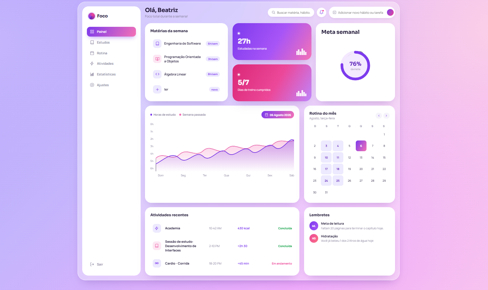

# foco-painel-estudos-
dashboard de controle de estudos e produtividade pessoal com interface desenvolvida em HTML, CSS  e JS.

## Funcionalidades

- **Gestão de Matérias:** Acompanhamento de horas semanais por disciplina.
- **Estatísticas Avançadas:** Métrica total de horas estudadas na semana e progresso de hábitos.
- **Gráfico de Desempenho:** Comparativo de horas de estudo por dia em relação à semana anterior.
- **Meta Semanal:** Indicador circular com a porcentagem da meta alcançada.
- **Calendário de Rotina:** Visão mensal clara dos dias do mês.
- **Atividades Recentes & Lembretes:** Histórico de exercícios/calorias e alertas diários.

---

## Linguagens Utilizadas

- 
- 
- 

---

Você pode clonar este repositório e rodar localmente no seu dispositivo:

# 1. Clone este repositório
$ git clone [https://github.com/beatrizamc/foco-painel-estudos.git](https://github.com/beatrizamc/foco-painel-estudos.git)

# 2. Acesse a pasta do projeto
$ cd foco-painel-estudos

# 3. Abra o arquivo index.html no seu navegador
# Ou utilize a extensão "Live Server" no VS Code
